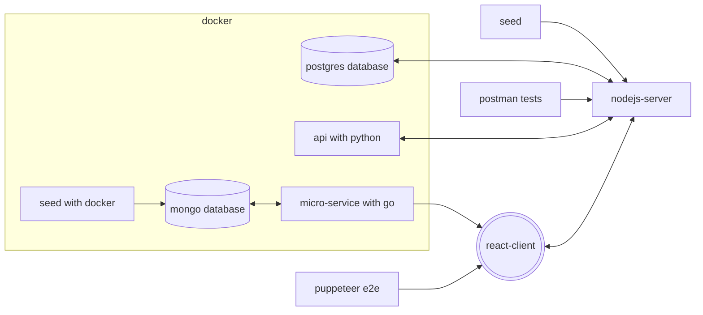

## What is this?

This is a refactor/extension of/on a project started/created by fellow student [Michelle Pesch](https://github.com/mipes4/sportsbetting_fe) at Codaisseur.

---

## Overview

```mermaid
flowchart LR
  A[seed]
  B[(postgres database)]
  C[nodejs-server]
  D(((react-client)))
  E[puppeteer e2e]
  F[api with python]
  G[postman tests]
  H[micro-service with go]
  I[(mongo database)]
  J[seed with docker]
  subgraph docker
  B
  F
  J
  I
  J-->I
  I<-->H
  end
  B<-->C
  F<-->C
  A-->C
  D<-->C
  E-->D
  H-->D
  G-->C
```
