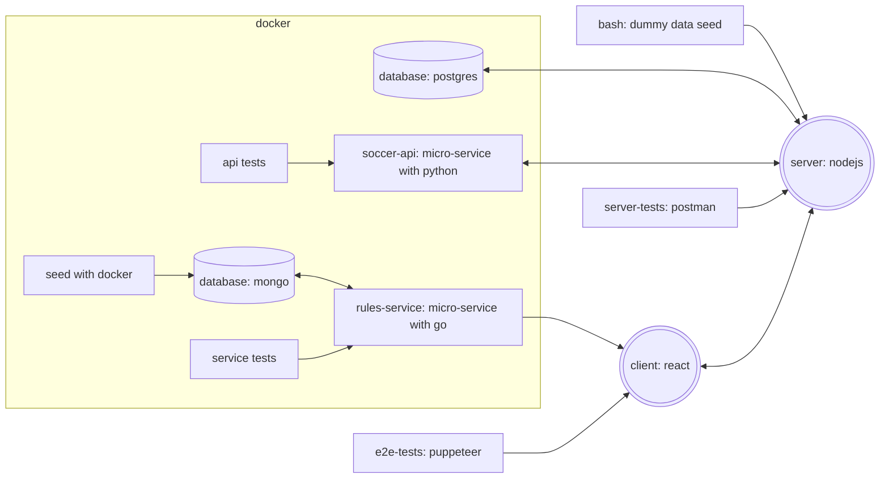

## What is this?

This is a refactor/extension of/on a project started/created by fellow student [Michelle Pesch](https://github.com/mipes4/sportsbetting_fe) at Codaisseur.

---

## Overview

[toto-game-client](https://github.com/willemverbuyst/toto-game-client)

[toto-game-server](https://github.com/willemverbuyst/toto-game-server)

[toto-game-soccer-api](https://github.com/willemverbuyst/toto-game-soccer-api)

[toto-game-rules-service](https://github.com/willemverbuyst/toto-game-soccer-api)

[toto-game-postman](https://github.com/willemverbuyst/toto-game-postman)

[toto-game-e2e](https://github.com/willemverbuyst/toto-game-e2e)
